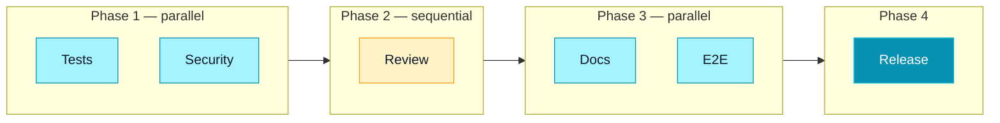

## The art of multi-agent orchestration

Multi-agent orchestration is about **combining multiple agents** to accomplish complex tasks that no single agent could handle efficiently. This is the advanced level of Claude Code usage, the one that turns an intelligent assistant into a true **automated development team**.

<Callout type="info" title="The orchestra conductor analogy">
An orchestra conductor doesn't play any instrument, but coordinates 80 musicians to produce a symphony. Multi-agent orchestration works the same way: you coordinate specialized agents to produce a result that none of them could achieve alone. Your role is that of the conductor: you define the score (the instructions), and Claude Code directs the execution.
</Callout>

## The 4 orchestration patterns

### 1. Sequential pattern

The simplest pattern: agents execute **one after another**, each using the previous one's result as input.

```bash
# Sequential: each agent depends on the previous one
> Step 1: Use the planner agent to plan the refactoring
> Step 2: Use the tdd-guide agent to implement according to the plan
> Step 3: Use the code-reviewer agent to validate the code
> Step 4: Use the doc-updater agent to update the docs
```

<Card title="When to use sequential?" variant="accent">
Use this pattern when each step depends on the previous one's result. This is the typical development pipeline: plan → code → review → document. Simple, predictable, easy to debug.
</Card>

**Advantages:**
- Easy to understand and debug
- Each step has clear context
- Errors are easily traceable

**Disadvantages:**
- Slow: steps cannot be parallelized
- If one step fails, the entire pipeline stops

### 2. Parallel pattern

Multiple agents work **simultaneously** on independent tasks, then their results are merged.

```bash
# Parallel: agents work at the same time
> Launch in parallel:
> - Agent security-reviewer: audit the auth module
> - Agent code-reviewer: review the API module
> - Agent e2e-runner: test the user journey
> Then synthesize the results from all three agents.
```

This pattern is ideal when tasks are independent. Claude Code can launch sub-agents simultaneously using the **run in background** feature.

```bash
# Conceptually, Claude Code does:
# 1. Launches 3 sub-agents in parallel (run_in_background: true)
# 2. Waits for all 3 to finish
# 3. Consolidates results into a single report
```

**Advantages:**
- Much faster than sequential
- Uses resources efficiently

**Disadvantages:**
- Agents cannot depend on each other's results
- Risk of conflicts if agents modify the same files

### 3. Pipeline pattern

A **pipeline** combines sequential and parallel: some steps are parallelized, others are sequential.



```bash
# Complete release pipeline
> Execute this pipeline:
>
> Phase 1 (parallel):
>   - Agent tdd-guide: verify all tests pass
>   - Agent security-reviewer: security audit
>
> Phase 2 (sequential, after Phase 1):
>   - Agent code-reviewer: final code review
>
> Phase 3 (parallel, after Phase 2):
>   - Agent doc-updater: documentation update
>   - Agent e2e-runner: end-to-end tests
>
> Phase 4 (sequential, after Phase 3):
>   - Prepare the release tag and changelog
```

<Steps>
<Step title="Phase 1: Parallel checks" stepNumber={1}>
Tests and the security audit are independent and can run in parallel. If either fails, the pipeline stops.
</Step>

<Step title="Phase 2: Sequential review" stepNumber={2}>
The review can only start once tests and security are validated. The reviewer needs to know the code is functional and safe.
</Step>

<Step title="Phase 3: Documentation and E2E" stepNumber={3}>
Documentation and E2E tests are independent. They can run in parallel after the review.
</Step>

<Step title="Phase 4: Release" stepNumber={4} isLast>
Release preparation is only triggered if all previous steps are green.
</Step>
</Steps>

### 4. Split-role pattern (multi-perspective)

Multiple agents analyze the **same subject** from different angles, then a synthesizer agent combines the perspectives.

```bash
# Split-role: multiple perspectives on the same problem
> Analyze this PR from 4 different angles:
>
> Agent 1 (factual): Verify the code does what the PR says
> Agent 2 (senior): Evaluate quality and maintainability
> Agent 3 (security): Look for security flaws
> Agent 4 (consistency): Check consistency with the rest of the codebase
>
> Then synthesize the 4 analyses into a consolidated report.
```

<Callout type="tip" title="Split-role for complex decisions">
The split-role pattern is particularly powerful for **architecture decisions**. Instead of getting a single opinion, you get 4 different and complementary perspectives. It's like assembling a committee of experts to make an informed decision.
</Callout>

## Context management between agents

One of the major challenges of orchestration is **context management**. Each agent has its own context window, and information is not automatically shared.

### Context passing strategies

```markdown
# Strategy 1: Via files
Agent A writes its results to a file.
Agent B reads that file at the start of its mission.

# Strategy 2: Via the prompt
The orchestrator agent summarizes Agent A's result
and includes it in Agent B's prompt.

# Strategy 3: Via Git
Agent A commits its changes.
Agent B works on the same branch and sees the modifications.
```

<Card title="Watch out for context overflow" variant="highlight">
Each sub-agent consumes context in the main agent. If you launch too many sub-agents or their results are too verbose, the main agent can hit its context window limit. Prefer concise, structured results.
</Card>

## Worktrees for isolation

**Git worktrees** are essential for multi-agent orchestration. They let each agent work in an isolated copy of the code without risk of conflict.

```bash
# Conceptually, Claude Code creates isolated worktrees:

# Agent 1 works in /tmp/worktree-security
git worktree add /tmp/worktree-security main

# Agent 2 works in /tmp/worktree-tests
git worktree add /tmp/worktree-tests main

# Agent 3 works in /tmp/worktree-docs
git worktree add /tmp/worktree-docs main

# Each agent modifies its files without affecting the others
# At the end, changes are merged
```

### When to use worktrees?

| Situation | Worktree? | Reason |
|---|---|---|
| Agents that only read | No | No risk of conflict |
| Agents modifying different files | Optional | Low risk of conflict |
| Agents modifying the same files | Yes | High risk of conflict |
| Agents in parallel | Recommended | Guaranteed isolation |

## Run in background

The **run in background** feature lets you launch sub-agents without blocking the main agent. This is essential for parallelization.

```bash
# Without background: forced sequential
# Agent A works... (60 seconds)
# Agent B works... (60 seconds)
# Total: 120 seconds

# With background: parallel
# Agent A works in background... (60 seconds)
# Agent B works in background... (60 seconds)
# Total: 60 seconds (both in parallel)
```

The main agent launches sub-agents in the background, continues its work, then retrieves results when they're ready.

## Best practices

### 1. Avoid context overflow

The golden rule: never use more than **80% of the context window** for multi-agent operations. Keep a margin for corrections and adjustments.

```markdown
# GOOD: Concise results
"The security audit found 3 issues:
1 CRITICAL (missing CSRF), 2 MEDIUM (rate limiting)."

# BAD: Verbose results
"I analyzed each file one by one. First auth.ts,
which contains 342 lines of code. Line 42 is
interesting because..." (500-line report)
```

### 2. Avoid duplicate work

Clearly define each agent's responsibilities to prevent two agents from doing the same work.

```markdown
# BAD: Overlap
Agent 1: "Review the code and check security"
Agent 2: "Check security and code quality"
# → Both do security = duplication

# GOOD: Distinct responsibilities
Agent 1: "Review code quality (readability, patterns, tests)"
Agent 2: "Security audit only (injection, XSS, secrets)"
# → Each in its own domain, no overlap
```

### 3. Define success criteria

Each agent must know when its task is **successfully completed**.

```markdown
## Success criteria for the testing agent
- All tests pass (exit code 0)
- Code coverage > 80%
- No flaky tests (rerun 3 times if a test fails)
- Coverage report generated in /coverage
```

### 4. Plan for error handling

What happens if an agent fails? Define a fallback plan.

```markdown
# Fallback plan
If the security-reviewer agent finds a CRITICAL issue:
  → Stop the pipeline
  → Notify the developer with the issue details
  → Do NOT continue to review or release

If the e2e-runner agent fails on a test:
  → Rerun the test 2 times (might be a flaky test)
  → If still failing, flag it and continue
```

## Full example: release pipeline

Here's a prompt that orchestrates a complete release pipeline using all the patterns.

```bash
> Execute a release pipeline for version 2.3.0:
>
> 1. PLANNING (sequential)
>    - Use the planner agent to list all changes
>      since the last tag
>
> 2. CHECKS (parallel)
>    - Agent tdd-guide: all tests pass, coverage 80%+
>    - Agent security-reviewer: full security audit
>    - Agent refactor-cleaner: no dead code introduced
>
> 3. REVIEW (split-role)
>    - Quality perspective: clean and maintainable code
>    - Performance perspective: no regressions
>    - Consistency perspective: coherent with the codebase
>
> 4. DOCUMENTATION (parallel)
>    - Agent doc-updater: update technical docs
>    - Generate the changelog since the last tag
>
> 5. RELEASE (sequential)
>    - If everything is green: create the v2.3.0 tag
>    - Generate the release notes
>
> If a CRITICAL step fails, stop everything and give me
> a detailed report of the problem.
```

This pipeline combines all 4 orchestration patterns for a robust and automated release process.

## Comparison with other multi-agent tools

Claude Code isn't the only tool offering agents. Here's how it compares to the main alternatives.

### Claude Code vs Devin

**Devin** (Cognition AI) is an autonomous development agent that runs in a complete cloud environment (browser, terminal, editor).

| Criterion | Claude Code | Devin |
|---|---|---|
| **Environment** | Your local terminal | Cloud (dedicated VM) |
| **Control** | Full, you see every action | Autonomous, final result |
| **Cost** | Pay-as-you-go (tokens) | Monthly subscription |
| **Customization** | Custom agents, MCP, Skills | Limited to built-in capabilities |
| **Collaboration** | You stay in the loop | The agent works alone |
| **Integration** | Terminal, SDK, CI/CD | Web interface + GitHub PRs |

Claude Code favors **control and customization**. Devin favors **full autonomy**. For well-defined and repetitive tasks, Devin may be more practical. For day-to-day development with fine-grained control, Claude Code has the edge.

### Claude Code vs Aider

**Aider** is an open-source pair-programming tool with LLMs, compatible with multiple models (GPT-4, Claude, etc.).

| Criterion | Claude Code | Aider |
|---|---|---|
| **Models** | Claude only (Haiku, Sonnet, Opus) | Multi-model (GPT-4, Claude, Gemini...) |
| **Agents** | Sub-agents, orchestration, SDK | No agent system |
| **Ecosystem** | MCP, Skills, Plugins | Limited to code editing |
| **Mode** | Interactive terminal + headless | Interactive terminal |
| **Pricing** | Included in Max/Pro subscription or API | Free (you pay for the API) |

Aider is excellent for simple pair-programming (editing code file by file). Claude Code goes further with multi-agent orchestration, MCPs for connecting external services, and the SDK for automation.

### Claude Code vs CrewAI

**CrewAI** is a Python framework for orchestrating specialized AI agents.

| Criterion | Claude Code | CrewAI |
|---|---|---|
| **Nature** | Complete tool (terminal + SDK) | Python code framework |
| **Agents** | Built-in, ready to use | Must be built entirely |
| **Models** | Claude (optimized) | Multi-model |
| **Setup** | `npm install` and you're ready | Python project, code to write |
| **Tools** | Bash, Read, Edit, Grep, MCP... | Must integrate manually |
| **Use cases** | Software development | Any type of agent (marketing, research...) |

CrewAI offers more flexibility for building custom multi-agent systems in any domain. Claude Code is optimized for software development with ready-to-use tools. If your need is 100% development, Claude Code is more productive. If you're building agents outside of development, CrewAI offers more freedom.

## Multi-agent architectures

Beyond orchestration patterns, two major architectures structure multi-agent systems.

### Leader/worker architecture

A main agent (leader) coordinates multiple specialized agents (workers). The leader receives the request, breaks it into sub-tasks, and distributes them.

```bash
# Leader: the orchestrator agent
> You coordinate 3 workers for the "CSV export" feature.
> Break down the task and assign each part.

# Worker 1: Backend
# → Implement the /api/export endpoint
# Worker 2: Frontend
# → Add the export button to the UI
# Worker 3: Tests
# → Write E2E tests for the export flow
```

This is the default architecture in Claude Code when it uses sub-agents: the main agent is the leader, the sub-agents are the workers.

**Strengths**: centralized coordination, clear global view, easy to debug.
**Weaknesses**: the leader is a single point of failure, it consumes a lot of context.

### Peer-to-peer architecture

Agents communicate directly with each other without a central coordinator. Each agent knows its role and knows when to hand off.

```bash
# Agent Teams in peer-to-peer mode
# Each agent works and signals when done
# Other agents react to changes

# Developer agent: codes → signals "code ready"
# Tester agent: detects "code ready" → writes tests
# Reviewer agent: detects "tests written" → reviews everything
```

This architecture corresponds to Claude Code's **Agent Teams** mode (see [Agent Teams](/agents/agent-teams)). Each agent has its own session and communicates via files and Git state.

**Strengths**: no central bottleneck, more resilient.
**Weaknesses**: more complex coordination, risk of conflicts, harder debugging.

## CI/CD integration with agents

Agents integrate into your CI/CD pipelines to automate pre-merge checks.

### GitHub Actions

```yaml
# .github/workflows/agent-review.yml
name: Agent Review
on:
  pull_request:
    types: [opened, synchronize]

jobs:
  review:
    runs-on: ubuntu-latest
    steps:
      - uses: actions/checkout@v4
        with:
          fetch-depth: 0

      - name: Setup Claude Code
        run: npm install -g @anthropic-ai/claude-code

      - name: Agent Review
        env:
          ANTHROPIC_API_KEY: ${{ secrets.ANTHROPIC_API_KEY }}
        run: |
          claude --print --max-turns 15 \
            "Do a complete review of this PR.
             Analyze the diff with git diff origin/main...HEAD.
             Produce a report with issues by severity.
             If you find a CRITICAL, end with EXIT_CODE=1."
```

### GitLab CI

```yaml
# .gitlab-ci.yml
agent-security-audit:
  stage: review
  image: node:20-alpine
  before_script:
    - npm install -g @anthropic-ai/claude-code
  script:
    - |
      claude --print --max-turns 10 \
        "Security audit on the diff for this MR.
         Look for: SQL injections, XSS, hardcoded secrets,
         vulnerable dependencies. JSON format."
  rules:
    - if: $CI_PIPELINE_SOURCE == "merge_request_event"
```

<Callout type="warning" title="CI secret security">
Never store your Anthropic API key in plaintext in the YAML file. Use CI secrets (GitHub Secrets, GitLab Variables) and verify that the agent cannot exfiltrate these values. The `--dangerously-skip-permissions` flag is necessary in CI but must be used with a restrictive `--allowedTools`.
</Callout>

### Full pipeline with the SDK

For finer control, use the SDK in a Node.js script called by your CI.

```typescript
// scripts/ci-review.ts
import { claude } from "@anthropic-ai/claude-code-sdk";

async function ciReview() {
  // Phase 1: Security
  const security = await claude({
    prompt: "Security audit of the diff against main",
    options: { maxTurns: 10, allowedTools: ["Bash", "Read", "Grep"] },
  });

  // Phase 2: Tests
  const tests = await claude({
    prompt: "Verify that test coverage is > 80%",
    options: { maxTurns: 8, allowedTools: ["Bash", "Read"] },
  });

  // Consolidated result
  const hasCritical = security.text.includes("CRITICAL");
  const lowCoverage = tests.text.includes("< 80%");

  if (hasCritical || lowCoverage) {
    console.error("Review failed:");
    if (hasCritical) console.error("- CRITICAL security issue");
    if (lowCoverage) console.error("- Insufficient coverage");
    process.exit(1);
  }

  console.log("Review OK");
}

ciReview();
```

## Next steps

You now master multi-agent orchestration. Continue learning with these related resources.

- [Claude Agent SDK](/agents/agent-sdk): Create programmatic agents in TypeScript and Python
- [Performance and limits](/agents/performance-limits): Costs, recursion depth, and best practices
- [Understanding agents](/agents/what-are-agents): Back to fundamentals
- [Create a sub-agent](/agents/create-subagent): Build custom agents for your needs
- [Headless mode and CI/CD](/advanced/headless-ci): Integrate Claude Code into your pipelines
