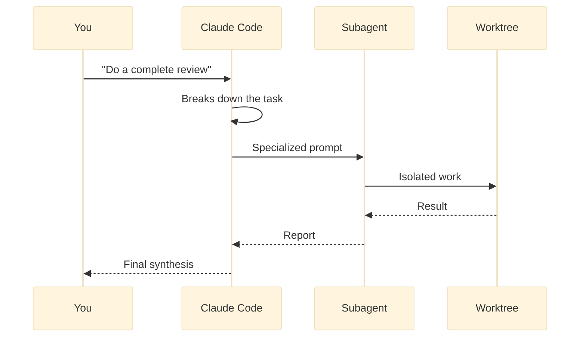

## What exactly are agents?

A Claude Code **agent** is an autonomous process that can execute a complex task end-to-end, without human intervention at every step. Unlike a simple prompt where you ask a question and get an answer, an agent **plans**, **executes**, **verifies**, and **iterates** until the objective is reached.

<Callout type="info" title="The consulting team analogy">
Think of Claude Code as the director of a team of specialist consultants. When you hand it a complex project, it doesn't do everything alone, it **delegates** to specialists. The security consultant audits the code, the testing consultant writes the tests, the architecture consultant validates the technical choices. Each consultant (sub-agent) works autonomously in their domain, then reports back to the director. This is exactly how Claude Code agents and sub-agents work.
</Callout>

## Agent vs traditional prompt

The fundamental difference between an agent and a traditional prompt comes down to three things.

| | **Traditional prompt** | **Agent** |
|---|---|---|
| **Interaction** | Question → Single answer | Goal → Planning → Execution → Verification |
| **Autonomy** | None, waits for your instructions | Makes decisions, uses tools, iterates |
| **Scope** | Simple, one-off task | Complete multi-step workflow |
| **Tools** | Uses the tools you ask for | Chooses and combines the necessary tools |
| **Duration** | A few seconds | Can last several minutes |

## How do sub-agents work?

A **sub-agent** is an agent launched by Claude Code to accomplish a specific sub-task. Claude Code uses the **Agent tool** (also called `Task`) to delegate work to child processes.

<Steps>
<Step title="Trigger" stepNumber={1}>
Claude Code identifies that a task requires specific expertise or isolated execution. It decides to launch a sub-agent via the `Task` tool.
</Step>

<Step title="Sub-agent creation" stepNumber={2}>
The sub-agent receives a **specialized prompt** describing its mission, constraints, and expected output format. It inherits a subset of the available tools.
</Step>

<Step title="Isolated execution" stepNumber={3}>
The sub-agent works autonomously in its own context. It can read files, run commands, and produce changes, all without polluting the main agent's context.
</Step>

<Step title="Reporting and integration" stepNumber={4} isLast>
The sub-agent sends its result back to the main agent, which integrates it into the overall workflow. If the result is insufficient, the main agent can relaunch the sub-agent or create a new one.
</Step>
</Steps>



## Types of agents

Claude Code agents fall into two main categories.

### Built-in agents

These are agents that ship with Claude Code or are defined in your project rules. They cover the most common use cases.

```bash
# Development agents
tdd-guide           # Enforces the Test-Driven Development workflow
code-reviewer       # Automated code review with severity ranking
build-error-resolver # Diagnosis and fix for build errors

# Architecture agents
planner             # Structured planning before implementation
architect           # System architecture decisions

# Quality agents
security-reviewer   # Systematic security audit
e2e-runner          # End-to-end testing of critical user flows

# Maintenance agents
refactor-cleaner    # Cleanup and dead code removal
doc-updater         # Documentation updates
```

### Custom agents

You can create your own agents by defining them in the `~/.claude/agents/` folder or `.claude/agents/` in your project. A custom agent is a Markdown file that describes the agent's role, tools, and instructions.

```markdown
# My database migration agent

## Role
You are a database migration expert.

## Available tools
- Bash (to run SQL commands)
- Read (to read existing migration files)
- Edit (to create new migrations)

## Instructions
1. Analyze the current database schema
2. Compare with the target schema
3. Generate the necessary migration files
4. Verify the reversibility of each migration
5. Test the migration on a test database
```

## Isolation and worktrees

A crucial aspect of sub-agents is their **isolation**. When a sub-agent modifies code, it can work in a separate **Git worktree**, an independent working copy separate from the main directory.

<Callout type="tip" title="Why isolation matters">
Without isolation, two sub-agents working in parallel could modify the same files and create conflicts. Worktrees guarantee that each sub-agent works in a clean environment. Once the work is done, changes are merged into the main branch.
</Callout>

```bash
# Claude Code can launch a sub-agent in an isolated worktree
# The sub-agent works on its own copy of the code
# No conflicts with other sub-agents or work in progress

# Conceptual example of what Claude Code does internally:
git worktree add /tmp/agent-security-review feature/security-audit
# The security-reviewer sub-agent works in /tmp/agent-security-review
# Once finished, changes are merged
```

## Configuring agents

Agents are configured at two levels: the `~/.claude/agents/` directory for your personal agents, and `.claude/agents/` in your project for agents shared with the team.

### The `~/.claude/agents/` directory

This folder contains your agents available across **all your projects**. Each `.md` file defines an agent.

```bash
~/.claude/
  agents/
    code-reviewer.md      # Automated code review
    tdd-guide.md          # TDD workflow
    security-reviewer.md  # Security audit
    planner.md            # Feature planning
```

Claude Code automatically detects these files. When you mention "use the code-reviewer agent" in a conversation, Claude Code loads the corresponding file and creates a sub-agent with those instructions.

### The `.claude/agents/` directory (project)

Agents in this directory are **version-controlled with Git** and shared among team members. It's the ideal place for project-specific agents.

```bash
my-project/
  .claude/
    agents/
      db-migration.md     # Project-specific
      api-reviewer.md     # Team API conventions
      release-manager.md  # Release process
```

<Callout type="tip" title="Agent priority">
If an agent with the same name exists at both levels, the project agent (`.claude/agents/`) takes priority over the global agent (`~/.claude/agents/`). Your team can override a personal agent with a version tailored to the project.
</Callout>

### The AGENTS.md file

The `AGENTS.md` file (at the project root or in a subdirectory) provides global context to all agents. Its role is similar to `CLAUDE.md`, but focused on agent behavior.

```markdown
# AGENTS.md

## Conventions for all agents
- Reports must be in English
- Severity levels: CRITICAL, HIGH, MEDIUM, LOW
- Test files follow the *.test.ts pattern
- Never modify configuration files directly

## Agents available in this project
- **db-migration**: manages Prisma migrations
- **api-reviewer**: checks the team's REST conventions
- **release-manager**: orchestrates the release process
```

Agents created by Claude Code automatically inherit the content of `AGENTS.md`, in addition to `CLAUDE.md`. It's a good place to centralize conventions that apply to all agents in the project.

## The Task tool (Agent)

Claude Code uses the **Task** tool to create and manage sub-agents. Here are the key parameters:

- **`description`**: the sub-agent's mission, as a detailed prompt
- **`subagent_type`**: the type of sub-agent (`default` for most cases)
- **`mode`**: the sub-agent's execution mode (`agent` for autonomous execution)

<Card title="Good to know" variant="highlight">
You don't need to manipulate the Task tool directly. Claude Code uses it automatically when it determines that delegation is appropriate. Your role is to configure the available agents and give Claude Code clear instructions so it knows when to use them.
</Card>

### Task for multi-step tracking

The Task tool isn't just for launching sub-agents. It also lets you **track the progress** of a complex workflow by creating intermediate tasks. Claude Code breaks down a goal into sub-tasks, marks each as in progress or completed, and shows you the overall progress.

```bash
# When you request a complex refactoring, Claude Code creates:
# ┌─ Task 1: Analyze existing code              ✅ Done
# ├─ Task 2: Write missing tests                ✅ Done
# ├─ Task 3: Refactor the auth module           🔄 In progress
# ├─ Task 4: Update imports                     ⬜ Pending
# └─ Task 5: Verify tests pass                  ⬜ Pending
```

This tracking is visible in the conversation. You can intervene at any time: "stop task 3" or "skip directly to task 5".

## Practical example: code review with agents

Here's a typical agent usage scenario:

```bash
# You ask Claude Code for a full review
> Do a complete review of my PR before merging

# Claude Code automatically orchestrates:
# 1. Launches the code-reviewer sub-agent → analyzes the diff
# 2. Launches the security-reviewer sub-agent → checks for vulnerabilities
# 3. Launches the tdd-guide sub-agent → checks test coverage
# 4. Synthesizes the results from all 3 agents
# 5. Produces a consolidated report with priorities
```

The result is a **multidimensional** review covering code quality, security, and tests, all in a single command.

## FAQ

<Faq>
  <FaqItem question="What is a Claude Code agent?">
    An agent is a specialized Claude instance with its own system prompt, dedicated tools and isolated context. It executes multi-step tasks autonomously without polluting the main conversation.
  </FaqItem>
  <FaqItem question="What's the difference between an agent and a subagent?">
    An agent is invoked directly by the user (by name mention). A subagent is invoked by another agent via the Task tool, to delegate a sub-task in its own isolated context.
  </FaqItem>
  <FaqItem question="How do I create a custom Claude Code agent?">
    Create a markdown file in .claude/agents/ with frontmatter (name, description, tools, model) and a system prompt. The agent becomes immediately available via @agent-name.
  </FaqItem>
  <FaqItem question="When should I use an agent vs a slash command?">
    A slash command is a prompt shortcut with no isolation. An agent isolates context, restricts tools and has a dedicated system prompt. Prefer agents for long or sensitive tasks.
  </FaqItem>
  <FaqItem question="How autonomous are Claude Code agents?">
    Very autonomous: they can chain dozens of tool calls without intervention. You keep control via permissions, hooks (e.g. PreToolUse), and the ability to interrupt at any time.
  </FaqItem>
  <FaqItem question="Can multiple agents run in parallel?">
    Yes, via the Task tool: a main agent can dispatch multiple subagents in parallel. Each has an isolated context and returns a consolidated result to the orchestrator.
  </FaqItem>
</Faq>

## Next steps

Now that you understand the concept of agents and sub-agents, let's get hands-on.

- [Create a specialized sub-agent](/agents/create-subagent): Complete guide to creating your own custom agents
- [Agent Teams](/agents/agent-teams): Making multiple agents collaborate together
- [Top agents by use case](/agents/best-agents): The must-have agents for every situation
