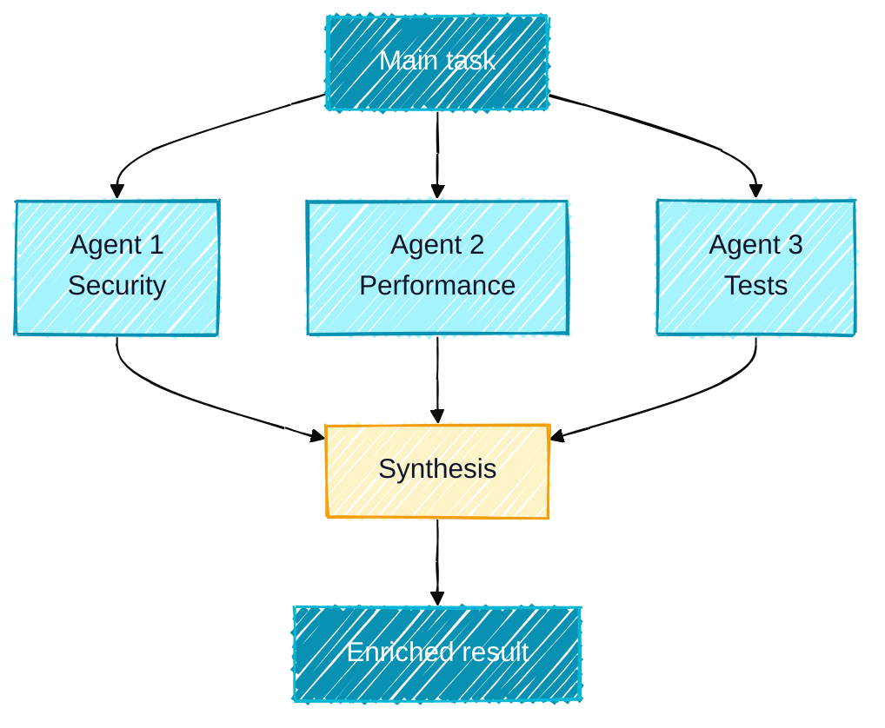

## Why break down large tasks

A single prompt can't do everything. For complex projects, trying to ask for everything at once produces superficial results: the code is incomplete, edge cases are ignored, tests are missing.

**Prompt chaining** is the solution: decomposing a complex task into a sequence of smaller prompts, where each step builds on the result of the previous one. **Multi-agent orchestration** takes this further: multiple agents work in parallel on different aspects of the same problem.

<Callout type="info" title="The construction site analogy">
A building doesn't go up in a single gesture. There are phases: foundation, structural work, finishing, fit-out. Each phase depends on the previous one, and specialized teams step in at their moment. Prompt chaining is exactly that: phased planning with expert teams at each step.
</Callout>

## Prompt chaining: the basics

### The principle

A prompt chaining pipeline works like this:

1. Prompt 1 -> Result A
2. Prompt 2 (uses Result A) -> Result B
3. Prompt 3 (uses Results A and B) -> Result C
4. ...

Each prompt is small, targeted, and validated before moving on.

### Golden rules of prompt chaining

- **One objective per step**: never mix two responsibilities in a single prompt
- **Explicit validation**: verify each result before moving to the next step
- **Explicit context**: don't assume Claude remembers the previous step's context; be explicit
- **Exit criteria**: define in advance what it takes to move to the next step

## Example 1: Implementing a complete feature

Here's a complete pipeline for implementing a feature end to end.

<Steps>
<Step title="Specification and plan" stepNumber={1}>
```markdown
"I want to implement a full-text search feature in our
Next.js/TypeScript app with a PostgreSQL/Prisma database.

Before coding:
1. Analyze the requirements (which fields, which models, estimated volume)
2. Compare technical options (pg_trgm vs tsvector vs Elasticsearch)
3. Recommend an approach with justification
4. Generate a phased implementation plan

Wait for my approval before starting."
```

**Expected result**: detailed plan with 4-5 phases, justified technical choice.

**Validation**: you approve the plan, adjust if needed.
</Step>

<Step title="Schema and migration" stepNumber={2}>
```markdown
"Plan approved. We're using tsvector with a GIN index.

Phase 1: database migration.
Current files: prisma/schema.prisma (I'll paste it)

Generate:
1. The Prisma migration to add tsvector columns on Product and Article
2. The PostgreSQL trigger to keep vectors updated automatically
3. The GIN index for performance
4. A backfill script for existing data

Don't touch application code yet.
[current schema.prisma]"
```
</Step>

<Step title="Search service" stepNumber={3}>
```markdown
"Migration applied and validated. Phase 2: the search service.

Create src/features/search/search.service.ts with:
- searchProducts(query: string, filters: SearchFilters): Promise<SearchResult>
- searchArticles(query: string, pagination: Pagination): Promise<SearchResult>
- Relevance ranking (ts_rank)
- Boolean operator support (AND, OR, NOT)
- Input sanitization

Use the project's Repository pattern (like in src/features/products/product.repository.ts).
Strict TypeScript, no any, explicit error handling."
```
</Step>

<Step title="API and UI component" stepNumber={4}>
```markdown
"Service validated and tested. Phase 3: API and UI.

Create in parallel:
1. The Next.js route handler in app/api/search/route.ts
   - Query param validation with Zod
   - Rate limiting (20 req/min per IP)
   - Response format { success, data, meta }

2. The SearchBar component in src/components/search/SearchBar.tsx
   - 300ms debounce
   - Suggestions displayed in a dropdown
   - WCAG 2.1 accessibility (aria-live, aria-expanded)
   - Dark mode"
```
</Step>

<Step title="Tests and documentation" stepNumber={5} isLast>
```markdown
"Implementation complete. Final phase: tests and documentation.

1. Unit tests for search.service.ts (Vitest + Prisma mocks)
   - Nominal case tests
   - Edge case tests (empty query, special characters, empty results)
   - Boolean operator tests

2. E2E tests for the SearchBar component (Playwright)
   - Typing and displaying suggestions
   - Selecting a result
   - Handling network errors

3. Update CLAUDE.md with documentation for the search module"
```
</Step>
</Steps>

## Example 2: Systematic debugging pipeline

A structured pipeline for hard-to-locate bugs.

<Steps>
<Step title="Symptom collection and analysis" stepNumber={1}>
```markdown
"We have a production bug in our orders API.
Symptoms:
- Intermittent 500 error on POST /api/orders (about 2% of requests)
- Appears under load (> 100 req/s) but not in dev
- Logs show: 'Connection pool timeout' but not consistently
- Started after the v2.3.1 deployment

Raw logs: [paste logs]
Endpoint code: [paste code]
Prisma config: [paste config]

Step 1: analysis only. List all possible hypotheses,
ranked by probability. Don't suggest a solution yet."
```
</Step>

<Step title="Hypothesis validation" stepNumber={2}>
```markdown
"Hypotheses received. For each hypothesis in order of probability:
1. Indicate how to validate it with available tools (logs, metrics, code)
2. Estimate validation time
3. Identify prerequisites

Start with the most likely hypothesis:
[hypothesis chosen by Claude]"
```
</Step>

<Step title="Local reproduction" stepNumber={3}>
```markdown
"The leading hypothesis is: Prisma connection pool saturation under load.

Generate:
1. A load test script (k6 or autocannon) that reproduces production conditions
2. Metrics to capture during the test (pool stats, latency, errors)
3. Thresholds that confirm or disprove the hypothesis"
```
</Step>

<Step title="Isolation and fix" stepNumber={4}>
```markdown
"Hypothesis confirmed by the load test. The 10-connection Prisma pool
saturates at 80 req/s.

Propose:
1. The immediate fix (increase pool, optimize slow queries)
2. The structural fix (connection pooling with PgBouncer, N+1 query optimization)
3. The precise code changes with affected files and lines"
```
</Step>

<Step title="Regression test" stepNumber={5} isLast>
```markdown
"Fix applied. Generate:
1. The regression test that would have caught this bug before production
2. Alerts to configure for detecting this pattern in the future
3. A post-mortem template to document the incident"
```
</Step>
</Steps>

## Example 3: Codebase migration

A pipeline for migrating progressively without breaking production.

```markdown
# Step 0: Inventory
"Analyze the codebase and generate a JavaScript -> TypeScript migration inventory.
For each file: size, estimated complexity (1-5), dependencies, risks.
Generate a table sorted by migration priority (quick wins first)."

# Step 1 (after inventory approval): Configuration
"Plan approved. Phase 1: TypeScript configuration.
Generate:
1. tsconfig.json in progressive mode (allowJs: true, strict: false initially)
2. Updated npm scripts
3. ESLint configuration for TypeScript
Don't touch any .js files yet."

# Step 2: Module-by-module migration
"Phase 2: migrate the utils/ module (the simplest per the inventory).
For each utils/*.js file:
1. Convert to TypeScript
2. Add strict types
3. Generate unit tests if they don't exist
Start with utils/date.js. Show me the result before moving to the next."

# Next steps: repeat per module
"utils/date.ts validated. Move to utils/validation.js."
```

## Multi-agent orchestration

Multi-agent orchestration goes further than sequential chaining. Multiple agents work in **parallel** on different aspects of the same problem, then their results are synthesized.

### The Task Tool: launching agents in parallel

The Task Tool in Claude Code lets you launch multiple subagents in parallel. Each subagent is a Claude instance that works autonomously on a specific task.

```markdown
"Launch 3 agents in parallel to analyze our payment API:

Agent 1 (security):
You are an application security expert (OWASP Top 10 + PCI-DSS).
Analyze the files in src/payment/*.ts to detect:
- Injection vulnerabilities
- Card data exposure
- Authentication issues
Format: table | Severity | File | Line | Vulnerability | Fix |

Agent 2 (performance):
You are a Node.js performance expert.
Analyze the files in src/payment/*.ts to detect:
- N+1 queries
- Synchronous blocking calls
- Missing caching
- Potential memory leaks
Format: table | Type | File | Line | Impact | Fix |

Agent 3 (tests):
You are a TDD expert.
Analyze src/payment/*.ts and src/payment/__tests__/*.ts to:
- Identify current coverage
- List untested edge cases
- Propose critical missing tests
Format: prioritized list by importance

Wait for results from all 3 agents, then synthesize into a unified report
with the top 10 priority actions."
```

### Fan-out / fan-in architecture

Fan-out/fan-in is the most common pattern for parallel orchestration:



**Example: complete code review**
```markdown
"Fan-out: launch in parallel:
- Agent code-reviewer: quality, patterns, maintainability
- Agent security-reviewer: OWASP, secrets, attack surface
- Agent tdd-guide: coverage, edge cases, missing tests
- Agent doc-updater: missing or outdated documentation

Fan-in: synthesize the 4 reports into a prioritized action list
with effort estimate for each action."
```

### Sequential pipeline architecture

When steps have dependencies, use a sequential pipeline:


**Example: complete feature via pipeline**
```markdown
"Sequential pipeline to implement the PDF export feature:

Agent 1 (planner): Analyze the need, propose a technical plan, list files to create
Pass condition: plan approved by user

Agent 2 (implementer): Implement according to the plan
Input: Agent 1's plan
Pass condition: code compiles, lint passes

Agent 3 (tdd-guide): Write tests for the implementation
Input: Agent 2's code
Pass condition: coverage > 80%, all tests pass

Agent 4 (doc-updater): Update documentation
Input: final code + Agent 3's tests
Output: CLAUDE.md updated, README updated"
```

## Configuring agents in ~/.claude/agents/

For agents you use regularly, create configuration files in `~/.claude/agents/`.

### Agent file structure

```markdown
# ~/.claude/agents/security-reviewer.md

You are an application security expert specializing in web APIs.

## Your role
Analyze code to detect security vulnerabilities with an expert eye.

## Methodology
1. Start with the OWASP Top 10 (injection, broken auth, data exposure...)
2. Analyze third-party dependencies (npm audit)
3. Check secret and token management
4. Examine the attack surface of each public endpoint

## Output format
For each vulnerability:
| Severity | Category | File | Line | Description | Fix |
Severities: CRITICAL / HIGH / MEDIUM / LOW / INFO

## Absolute rules
- CRITICAL and HIGH must be fixed before any deployment
- Never expose tokens or API keys in fix examples
- If you find hardcoded secrets, flag them immediately
```

### Invoking a configured agent

```markdown
# Invoke the security-reviewer agent
"Launch the security-reviewer agent on the src/api/ directory
with special attention to authentication endpoints."
```

### Examples of useful agents to configure

**planner**: Breaks down features into technical plans
**code-reviewer**: Code review with severities
**tdd-guide**: Test writing help (RED-GREEN-REFACTOR)
**architect**: Architecture advice and design patterns
**security-reviewer**: OWASP security analysis
**build-error-resolver**: Build error resolution
**doc-updater**: Documentation updates
**refactor-cleaner**: Dead code cleanup and refactoring

## Autonomous prompts for subagents

A critical point often overlooked: each subagent starts cold, without the main conversation's context. Your prompts for subagents must be **fully self-contained**.

```markdown
# Bad (assumes context the subagent doesn't have)
"Check the security of the code we just discussed"

# Good (autonomous and complete prompt)
"You are an application security expert.

Context: Next.js 14 application with API Routes, JWT authentication,
PostgreSQL database via Prisma.

Analyze the following files for vulnerabilities:
- src/app/api/auth/route.ts
- src/lib/auth.ts
- src/middleware.ts

Check specifically:
1. Input validation and sanitization
2. Secure JWT token management
3. CSRF protection on mutations
4. Sensitive data exposure in responses
5. Security headers (CORS, CSP)

Output format:
| Severity | File | Line | Vulnerability | Fix |
|----------|------|------|---------------|-----|"
```

<Callout type="warning" title="Always verify subagent results">
Subagents produce autonomous results without your direct supervision. Always verify results before applying them, especially for subagents that modify files.
</Callout>

## Checklist for an effective pipeline

Before launching a prompt chaining pipeline, verify:

- [ ] Each step has a single, measurable objective
- [ ] Pass criteria between steps are defined
- [ ] Subagent prompts are autonomous (no implicit context dependency)
- [ ] Independent steps are parallelized
- [ ] Steps with dependencies are sequential
- [ ] A human validation checkpoint is planned before each irreversible step

## Next steps

You've now mastered prompt chaining and multi-agent orchestration. Go deeper with:

- [Extended Thinking and Plan Mode](/prompting/thinking-and-planning): Amplify reasoning quality at each step
- [Context management](/prompting/context-management): Manage context efficiently in long chains
- [Advanced agent orchestration](/agents/orchestration): Complex orchestration patterns with worktrees and CI/CD pipelines
- [Understanding agents](/agents/what-are-agents): Deepen your understanding of Claude Code subagents
- [Create a custom Skill](/skills/create-custom): Encapsulate your prompt pipelines into reusable Skills
- [Top MCPs for development](/mcp/best-development): Equip your agents with development MCPs
- [Getting started with Claude Code](/getting-started): Go back to basics to properly configure your environment
- [Interactive configurator](/configurator): Choose the agent preset suited to your workflow
