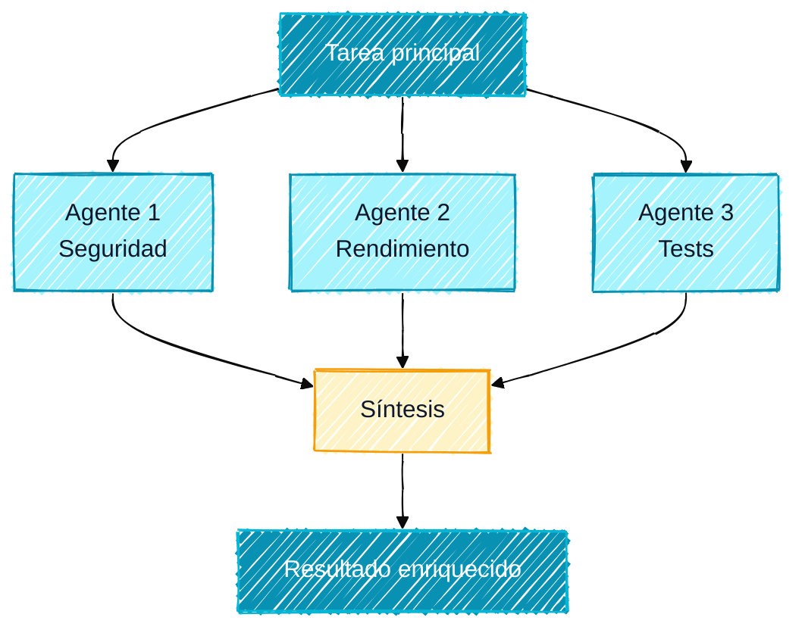

## Por qué descomponer las tareas grandes

Un solo prompt no puede hacerlo todo. En proyectos complejos, intentar pedirlo todo de una vez produce resultados superficiales: el código queda incompleto, los casos límite se ignoran, faltan los tests.

El **prompt chaining** es la solución: descomponer una tarea compleja en una secuencia de prompts más pequeños, donde cada paso se apoya en el resultado del anterior. La **orquestación multiagente** lleva este principio más lejos: varios agentes trabajan en paralelo sobre distintos aspectos de un mismo problema.

<Callout type="info" title="La analogía de la obra de construcción">
Un edificio no se construye de una sola vez. Hay fases: cimientos, estructura, instalaciones, acabados. Cada fase depende de la anterior, y equipos especializados intervienen en su momento. El prompt chaining es exactamente eso: una planificación por fases con equipos expertos en cada etapa.
</Callout>

## El prompt chaining: las bases

### Principio

Un pipeline de prompt chaining funciona así:

1. Prompt 1 → Resultado A
2. Prompt 2 (que usa el Resultado A) → Resultado B
3. Prompt 3 (que usa los Resultados A y B) → Resultado C
4. ...

Cada prompt es pequeño, enfocado y se valida antes de pasar al siguiente.

### Reglas de oro del prompt chaining

- **Un objetivo por etapa**: nunca mezcles dos responsabilidades en un solo prompt
- **Validación explícita**: comprueba cada resultado antes de pasar a la siguiente etapa
- **Contexto explícito**: no des por hecho que Claude recuerda el contexto de la etapa anterior, sé explícito
- **Puntos de salida**: define de antemano los criterios que permiten pasar a la siguiente etapa

## Ejemplo 1: implementar una funcionalidad completa

Aquí tienes un pipeline completo para implementar una funcionalidad de principio a fin.

<Steps>
<Step title="Especificación y plan" stepNumber={1}>
```markdown
"Quiero implementar una funcionalidad de búsqueda full-text en nuestra app
Next.js/TypeScript con base de datos PostgreSQL/Prisma.

Antes de programar:
1. Analiza las necesidades (qué campos, qué modelos, volumen estimado)
2. Compara las opciones técnicas (pg_trgm vs tsvector vs Elasticsearch)
3. Recomienda un enfoque con justificación
4. Genera un plan de implementación por fases

Espera mi validación antes de empezar."
```

**Resultado esperado**: plan detallado con 4-5 fases, elección técnica justificada.

**Validación**: validas el plan, ajustas si hace falta.
</Step>

<Step title="Esquema y migración" stepNumber={2}>
```markdown
"El plan está validado. Usamos tsvector con índice GIN.

Fase 1: migración de base de datos.
Archivos actuales: prisma/schema.prisma (voy a pegarlo)

Genera:
1. La migración de Prisma para añadir las columnas tsvector en Product y Article
2. El trigger de PostgreSQL para mantener los vectores actualizados automáticamente
3. El índice GIN para el rendimiento
4. Un script de backfill para los datos existentes

No toques todavía el código de la aplicación.
[schema.prisma actual]"
```
</Step>

<Step title="Servicio de búsqueda" stepNumber={3}>
```markdown
"Migración aplicada y validada. Fase 2: el servicio de búsqueda.

Crea src/features/search/search.service.ts con:
- Método searchProducts(query: string, filters: SearchFilters): Promise<SearchResult>
- Método searchArticles(query: string, pagination: Pagination): Promise<SearchResult>
- Gestión del ranking por relevancia (ts_rank)
- Soporte de operadores booleanos (AND, OR, NOT)
- Sanitización de los inputs

Usa el patrón Repository del proyecto (como en src/features/products/product.repository.ts).
TypeScript estricto, sin any, gestión de errores explícita."
```
</Step>

<Step title="API y componente UI" stepNumber={4}>
```markdown
"Servicio validado y probado. Fase 3: la API y la UI.

Crea en paralelo:
1. El route handler de Next.js en app/api/search/route.ts
   - Validación de los query params con Zod
   - Rate limiting (20 req/min por IP)
   - Formato de respuesta { success, data, meta }

2. El componente SearchBar en src/components/search/SearchBar.tsx
   - Debounce de 300ms
   - Visualización de sugerencias en dropdown
   - Accesibilidad WCAG 2.1 (aria-live, aria-expanded)
   - Dark mode"
```
</Step>

<Step title="Tests y documentación" stepNumber={5} isLast>
```markdown
"Implementación terminada. Fase final: tests y documentación.

1. Tests unitarios para search.service.ts (Vitest + mock de Prisma)
   - Tests de los casos normales
   - Tests de los edge cases (query vacía, caracteres especiales, resultados vacíos)
   - Tests de los operadores booleanos

2. Tests E2E para el componente SearchBar (Playwright)
   - Introducción y visualización de sugerencias
   - Selección de un resultado
   - Gestión de errores de red

3. Actualización del CLAUDE.md con la documentación del módulo search"
```
</Step>
</Steps>

## Ejemplo 2: pipeline de depuración sistemática

Un pipeline estructurado para bugs difíciles de localizar.

<Steps>
<Step title="Recopilación y análisis de los síntomas" stepNumber={1}>
```markdown
"Tenemos un bug de producción en nuestra API de pedidos.
Síntomas:
- Error 500 intermitente en POST /api/orders (aproximadamente un 2% de las peticiones)
- Aparece bajo carga (> 100 req/s) pero no en desarrollo
- Los logs muestran: 'Connection pool timeout' pero no siempre
- Empezó tras el despliegue v2.3.1

Logs en bruto: [pegar los logs]
Código del endpoint: [pegar el código]
Configuración de Prisma: [pegar la configuración]

Paso 1: solo análisis. Lista todas las hipótesis posibles,
ordenadas por probabilidad. Todavía no propongas una solución."
```
</Step>

<Step title="Validación de las hipótesis" stepNumber={2}>
```markdown
"Hipótesis recibidas. Para cada hipótesis, en orden de probabilidad:
1. Indica cómo validarla con las herramientas disponibles (logs, métricas, código)
2. Estima el tiempo de validación
3. Identifica los requisitos previos

Empieza por la hipótesis más probable:
[hipótesis elegida por Claude]"
```
</Step>

<Step title="Reproducción en local" stepNumber={3}>
```markdown
"La hipótesis principal es: saturación del connection pool de Prisma bajo carga.

Genera:
1. Un script de load test (k6 o autocannon) que reproduzca las condiciones de producción
2. Las métricas a capturar durante el test (estadísticas del pool, latencia, errores)
3. Los umbrales que confirman o descartan la hipótesis"
```
</Step>

<Step title="Aislamiento y corrección" stepNumber={4}>
```markdown
"Hipótesis confirmada por el load test. El pool de Prisma de 10 conexiones
se satura a partir de 80 req/s.

Propón:
1. La corrección inmediata (aumentar el pool, optimizar las consultas lentas)
2. La corrección estructural (connection pooling con PgBouncer, optimización de las queries N+1)
3. Los cambios de código exactos con archivos y líneas afectados"
```
</Step>

<Step title="Test de regresión" stepNumber={5} isLast>
```markdown
"Corrección aplicada. Genera:
1. El test de regresión que habría detectado este bug antes de la puesta en producción
2. Las alertas que hay que configurar para detectar este patrón en el futuro
3. La plantilla de post-mortem para documentar el incidente"
```
</Step>
</Steps>

## Ejemplo 3: migración de codebase

Un pipeline para migrar progresivamente sin romper la producción.

```markdown
# Paso 0: Inventario
"Analiza la codebase y genera un inventario de migración JavaScript → TypeScript.
Para cada archivo: tamaño, complejidad estimada (1-5), dependencias, riesgos.
Genera una tabla ordenada por prioridad de migración (quick wins primero)."

# Paso 1 (tras validar el inventario): Configuración
"Plan validado. Fase 1: configuración de TypeScript.
Genera:
1. tsconfig.json en modo progresivo (allowJs: true, strict: false al principio)
2. Los scripts de npm actualizados
3. La configuración de ESLint para TypeScript
No toques ningún archivo .js por ahora."

# Paso 2: migración módulo por módulo
"Fase 2: migración del módulo utils/ (el más simple según el inventario).
Para cada archivo utils/*.js:
1. Conviértelo a TypeScript
2. Añade los tipos estrictos
3. Genera los tests unitarios si no existen
Empieza por utils/date.js. Muéstrame el resultado antes de pasar al siguiente."

# Pasos siguientes: repetir por módulo
"utils/date.ts validado. Pasa a utils/validation.js."
```

## Orquestación multiagente

La orquestación multiagente va más allá del chaining secuencial. Varios agentes trabajan en **paralelo** sobre distintos aspectos de un mismo problema, y luego sus resultados se sintetizan.

### El Task Tool: lanzar agentes en paralelo

El Task Tool de Claude Code permite lanzar varios subagentes en paralelo. Cada subagente es una instancia de Claude que trabaja de forma autónoma en una tarea específica.

```markdown
"Lanza 3 agentes en paralelo para analizar nuestra API de pagos:

Agente 1 (seguridad):
Eres un experto en seguridad de aplicaciones (OWASP Top 10 + PCI-DSS).
Analiza los archivos src/payment/*.ts para detectar:
- Vulnerabilidades de inyección
- Exposición de datos de tarjetas
- Problemas de autenticación
Formato: tabla | Gravedad | Archivo | Línea | Vulnerabilidad | Corrección |

Agente 2 (rendimiento):
Eres un experto en rendimiento de Node.js.
Analiza los archivos src/payment/*.ts para detectar:
- Consultas N+1
- Llamadas síncronas bloqueantes
- Falta de caché
- Posibles memory leaks
Formato: tabla | Tipo | Archivo | Línea | Impacto | Corrección |

Agente 3 (tests):
Eres un experto en TDD.
Analiza los archivos src/payment/*.ts y src/payment/__tests__/*.ts para:
- Identificar la cobertura actual
- Listar los casos límite no probados
- Proponer los tests críticos que faltan
Formato: lista priorizada por importancia

Espera los resultados de los 3 agentes y luego sintetízalos en un informe unificado
con las 10 acciones prioritarias."
```

### Arquitectura fan-out / fan-in

La arquitectura fan-out/fan-in es el patrón más habitual para la orquestación en paralelo:



**Ejemplo: revisión de código completa**
```markdown
"Fan-out: lanza en paralelo:
- Agente code-reviewer: calidad, patrones, mantenibilidad
- Agente security-reviewer: OWASP, secretos, superficie de ataque
- Agente tdd-guide: cobertura, casos límite, tests que faltan
- Agente doc-updater: documentación faltante u obsoleta

Fan-in: sintetiza los 4 informes en una lista de acciones prioritarias
con una estimación de esfuerzo para cada acción."
```

### Arquitectura de pipeline secuencial

Cuando las etapas tienen dependencias, usa un pipeline secuencial:


**Ejemplo: funcionalidad completa en pipeline**
```markdown
"Pipeline secuencial para implementar la funcionalidad de exportación a PDF:

Agente 1 (planner): analiza la necesidad, propone un plan técnico, lista los archivos a crear
Condición de paso: plan validado por el usuario

Agente 2 (implementer): implementa según el plan
Input: plan del Agente 1
Condición de paso: el código compila, el lint pasa

Agente 3 (tdd-guide): escribe los tests para la implementación
Input: código del Agente 2
Condición de paso: cobertura > 80%, todos los tests pasan

Agente 4 (doc-updater): actualiza la documentación
Input: código final + tests del Agente 3
Output: CLAUDE.md actualizado, README actualizado"
```

## Configuración de agentes en ~/.claude/agents/

Para los agentes que usas con regularidad, crea archivos de configuración en `~/.claude/agents/`.

### Estructura de un archivo de agente

```markdown
# ~/.claude/agents/security-reviewer.md

Eres un experto en seguridad de aplicaciones especializado en API web.

## Tu rol
Analizar el código para detectar vulnerabilidades de seguridad con mirada experta.

## Metodología
1. Empieza por el OWASP Top 10 (inyección, autenticación rota, exposición de datos...)
2. Analiza las dependencias de terceros (npm audit)
3. Comprueba la gestión de secretos y tokens
4. Examina la superficie de ataque de cada endpoint público

## Formato de salida
Para cada vulnerabilidad:
| Gravedad | Categoría | Archivo | Línea | Descripción | Corrección |
Gravedades: CRITICAL / HIGH / MEDIUM / LOW / INFO

## Reglas absolutas
- CRITICAL y HIGH deben corregirse antes de cualquier despliegue
- Nunca expongas tokens ni claves API en los ejemplos de corrección
- Si encuentras secretos hardcodeados, señálalos de inmediato
```

### Invocar un agente configurado

```markdown
# Invocar el agente security-reviewer
"Lanza el agente security-reviewer sobre la carpeta src/api/
prestando especial atención a los endpoints de autenticación."
```

### Ejemplos de agentes útiles para configurar

**planner**: descompone las funcionalidades en planes técnicos
**code-reviewer**: revisión de código con niveles de gravedad
**tdd-guide**: ayuda a escribir tests (RED-GREEN-REFACTOR)
**architect**: consejos de arquitectura y patrones de diseño
**security-reviewer**: análisis de seguridad OWASP
**build-error-resolver**: resolución de errores de build
**doc-updater**: actualización de la documentación
**refactor-cleaner**: limpieza de código muerto y refactorización

## Prompts autónomos para los subagentes

Un punto crítico que suele pasarse por alto: cada subagente arranca en frío, sin el contexto de la conversación principal. Tus prompts para los subagentes deben ser **totalmente autónomos**.

```markdown
# Mal (asume un contexto que el subagente no tiene)
"Comprueba la seguridad del código del que acabamos de hablar"

# Bien (prompt autónomo y completo)
"Eres un experto en seguridad de aplicaciones.

Contexto: aplicación Next.js 14 con API Routes, autenticación JWT,
base de datos PostgreSQL vía Prisma.

Analiza los siguientes archivos para detectar vulnerabilidades:
- src/app/api/auth/route.ts
- src/lib/auth.ts
- src/middleware.ts

Comprueba específicamente:
1. Validación y sanitización de los inputs
2. Gestión segura de los tokens JWT
3. Protección CSRF en las mutaciones
4. Exposición de datos sensibles en las respuestas
5. Cabeceras de seguridad (CORS, CSP)

Formato de salida:
| Gravedad | Archivo | Línea | Vulnerabilidad | Corrección |
|----------|---------|-------|---------------|------------|"
```

<Callout type="warning" title="Verifica siempre los resultados de los subagentes">
Los subagentes producen resultados de forma autónoma sin tu supervisión directa. Verifica siempre los resultados antes de aplicarlos, sobre todo con los subagentes que modifican archivos.
</Callout>

## Checklist para un pipeline eficaz

Antes de lanzar un pipeline de prompt chaining, comprueba:

- [ ] Cada etapa tiene un objetivo único y medible
- [ ] Los criterios de paso entre etapas están definidos
- [ ] Los prompts de los subagentes son autónomos (sin dependencia de contexto implícito)
- [ ] Las etapas independientes se paralelizan
- [ ] Las etapas con dependencias son secuenciales
- [ ] Se prevé un punto de validación humana antes de cada etapa irreversible

## Próximos pasos

Ahora dominas el prompt chaining y la orquestación multiagente. Profundiza con:

- [Extended Thinking y Plan Mode](/prompting/thinking-and-planning): amplifica la calidad del razonamiento en cada etapa
- [Gestión del contexto](/prompting/context-management): gestiona eficazmente el contexto en cadenas largas
- [Orquestación avanzada de agentes](/agents/orchestration): patrones de orquestación complejos con worktrees y pipelines CI/CD
- [Entender los agentes](/agents/what-are-agents): profundiza en la comprensión de los subagentes de Claude Code
- [Crear una Skill personalizada](/skills/create-custom): encapsula tus pipelines de prompts en Skills reutilizables
- [Los mejores MCP para el desarrollo](/mcp/best-development): equipa a tus agentes con los MCP de desarrollo
- [Primeros pasos con Claude Code](/getting-started): vuelve a las bases para configurar bien tu entorno
- [Configurador interactivo](/configurator): elige el preset de agentes adaptado a tu flujo de trabajo
