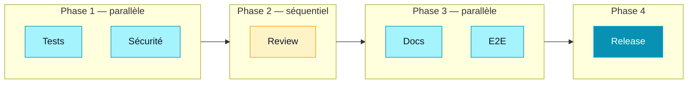

## L'art de l'orchestration multi-agents

L'orchestration multi-agents consiste à **combiner plusieurs agents** pour accomplir des tâches complexes qu'aucun agent seul ne pourrait réaliser efficacement. C'est le niveau avancé de l'utilisation de Claude Code, celui qui transforme un assistant intelligent en une véritable **équipe de développement automatisée**.

<Callout type="info" title="L'analogie du chef d'orchestre">
Un chef d'orchestre ne joue d'aucun instrument, mais il coordonne 80 musiciens pour produire une symphonie. De la même manière, l'orchestration multi-agents consiste à coordonner des agents spécialisés pour produire un résultat qu'aucun d'entre eux ne pourrait atteindre seul. Votre rôle est celui du chef d'orchestre : vous définissez la partition (les instructions), et Claude Code dirige l'exécution.
</Callout>

## Les 4 patterns d'orchestration

### 1. Pattern séquentiel

Le pattern le plus simple : les agents s'exécutent **l'un après l'autre**, chacun utilisant le résultat du précédent comme input.

```bash
# Séquentiel : chaque agent dépend du précédent
> Étape 1 : Utilise l'agent planner pour planifier le refactoring
> Étape 2 : Utilise l'agent tdd-guide pour implémenter selon le plan
> Étape 3 : Utilise l'agent code-reviewer pour valider le code
> Étape 4 : Utilise l'agent doc-updater pour mettre à jour la doc
```

<Card title="Quand utiliser le séquentiel ?" variant="accent">
Utilisez ce pattern quand chaque étape dépend du résultat de la précédente. C'est le cas typique du pipeline de développement : planifier → coder → reviewer → documenter. Simple, prévisible, facile à débugger.
</Card>

**Avantages :**
- Facile à comprendre et à débugger
- Chaque étape a un contexte clair
- Les erreurs sont facilement traçables

**Inconvénients :**
- Lent : les étapes ne peuvent pas être parallélisées
- Si une étape échoue, tout le pipeline s'arrête

### 2. Pattern parallèle

Plusieurs agents travaillent **simultanément** sur des tâches indépendantes, puis leurs résultats sont fusionnés.

```bash
# Parallèle : les agents travaillent en même temps
> Lance en parallèle :
> - Agent security-reviewer : audite le module auth
> - Agent code-reviewer : review le module API
> - Agent e2e-runner : teste le parcours utilisateur
> Puis synthétise les résultats des trois agents.
```

Ce pattern est idéal quand les tâches sont indépendantes. Claude Code peut lancer les subagents simultanément en utilisant la fonctionnalité **run in background**.

```bash
# Conceptuellement, Claude Code fait :
# 1. Lance 3 subagents en parallèle (run_in_background: true)
# 2. Attend que les 3 aient terminé
# 3. Consolide les résultats dans un rapport unique
```

**Avantages :**
- Beaucoup plus rapide que le séquentiel
- Utilise les ressources efficacement

**Inconvénients :**
- Les agents ne peuvent pas dépendre des résultats des autres
- Risque de conflits si les agents modifient les mêmes fichiers

### 3. Pattern pipeline

Un **pipeline** combine le séquentiel et le parallèle : certaines étapes sont parallélisées, d'autres sont séquentielles.



```bash
# Pipeline complet de release
> Exécute ce pipeline :
>
> Phase 1 (parallèle) :
>   - Agent tdd-guide : vérifie que tous les tests passent
>   - Agent security-reviewer : audit de sécurité
>
> Phase 2 (séquentiel, après Phase 1) :
>   - Agent code-reviewer : review finale du code
>
> Phase 3 (parallèle, après Phase 2) :
>   - Agent doc-updater : mise à jour de la documentation
>   - Agent e2e-runner : tests end-to-end
>
> Phase 4 (séquentiel, après Phase 3) :
>   - Prépare le tag de release et le changelog
```

<Steps>
<Step title="Phase 1 : Vérifications parallèles" stepNumber={1}>
Les tests et l'audit de sécurité sont indépendants et peuvent s'exécuter en parallèle. Si l'un des deux échoue, le pipeline s'arrête.
</Step>

<Step title="Phase 2 : Review séquentielle" stepNumber={2}>
La review ne peut commencer qu'une fois les tests et la sécurité validés. Le reviewer a besoin de savoir que le code est fonctionnel et sûr.
</Step>

<Step title="Phase 3 : Documentation et E2E" stepNumber={3}>
La documentation et les tests E2E sont indépendants. Ils peuvent s'exécuter en parallèle après la review.
</Step>

<Step title="Phase 4 : Release" stepNumber={4} isLast>
La préparation de la release n'est déclenchée que si toutes les étapes précédentes sont vertes.
</Step>
</Steps>

### 4. Pattern split-role (multi-perspectives)

Plusieurs agents analysent le **même sujet** sous des angles différents, puis un agent synthétiseur combine les perspectives.

```bash
# Split-role : perspectives multiples sur un même problème
> Analyse cette PR sous 4 angles différents :
>
> Agent 1 (factuel) : Vérifie que le code fait ce que la PR dit
> Agent 2 (senior) : Évalue la qualité et la maintenabilité
> Agent 3 (sécurité) : Cherche les failles de sécurité
> Agent 4 (consistance) : Vérifie la cohérence avec le reste du codebase
>
> Puis synthétise les 4 analyses en un rapport consolidé.
```

<Callout type="tip" title="Le split-role pour les décisions complexes">
Le pattern split-role est particulièrement puissant pour les **décisions d'architecture**. Au lieu de demander un seul avis, vous obtenez 4 perspectives différentes et complémentaires. C'est comme réunir un comité d'experts pour prendre une décision éclairée.
</Callout>

## Gestion du contexte entre agents

Un des défis majeurs de l'orchestration est la **gestion du contexte**. Chaque agent a sa propre fenêtre de contexte, et les informations ne sont pas automatiquement partagées.

### Stratégies de passage de contexte

```markdown
# Stratégie 1 : Via les fichiers
L'agent A écrit ses résultats dans un fichier.
L'agent B lit ce fichier au début de sa mission.

# Stratégie 2 : Via le prompt
L'agent orchestrateur résume le résultat de l'agent A
et l'inclut dans le prompt de l'agent B.

# Stratégie 3 : Via Git
L'agent A commite ses changements.
L'agent B travaille sur la même branche et voit les modifications.
```

<Card title="Attention au context overflow" variant="highlight">
Chaque agent subagent consomme du contexte dans l'agent principal. Si vous lancez trop de subagents ou que leurs résultats sont trop verbeux, l'agent principal peut atteindre la limite de sa fenêtre de contexte. Préférez des résultats concis et structurés.
</Card>

## Worktrees pour l'isolation

Les **worktrees Git** sont essentiels pour l'orchestration multi-agents. Ils permettent à chaque agent de travailler dans une copie isolée du code sans risque de conflit.

```bash
# Conceptuellement, Claude Code crée des worktrees isolés :

# Agent 1 travaille dans /tmp/worktree-security
git worktree add /tmp/worktree-security main

# Agent 2 travaille dans /tmp/worktree-tests
git worktree add /tmp/worktree-tests main

# Agent 3 travaille dans /tmp/worktree-docs
git worktree add /tmp/worktree-docs main

# Chaque agent modifie ses fichiers sans affecter les autres
# À la fin, les changements sont fusionnés
```

### Quand utiliser les worktrees ?

| Situation | Worktree ? | Raison |
|---|---|---|
| Agents qui lisent seulement | Non | Pas de risque de conflit |
| Agents qui modifient des fichiers différents | Optionnel | Faible risque de conflit |
| Agents qui modifient les mêmes fichiers | Oui | Risque élevé de conflit |
| Agents en parallèle | Recommandé | Isolation garantie |

## Run in background

La fonctionnalité **run in background** permet de lancer des subagents sans bloquer l'agent principal. C'est essentiel pour la parallélisation.

```bash
# Sans background : séquentiel forcé
# Agent A travaille... (60 secondes)
# Agent B travaille... (60 secondes)
# Total : 120 secondes

# Avec background : parallèle
# Agent A travaille en background... (60 secondes)
# Agent B travaille en background... (60 secondes)
# Total : 60 secondes (les deux en parallèle)
```

L'agent principal lance les subagents en background, continue son travail, puis récupère les résultats quand ils sont prêts.

## Bonnes pratiques

### 1. Évitez le context overflow

La règle d'or : ne jamais utiliser plus de **80% de la fenêtre de contexte** pour des opérations multi-agents. Gardez une marge pour les corrections et ajustements.

```markdown
# BON : Résultats concis
"L'audit de sécurité a trouvé 3 problèmes :
1 CRITICAL (CSRF manquant), 2 MEDIUM (rate limiting)."

# MAUVAIS : Résultats verbeux
"J'ai analysé chaque fichier un par un. D'abord auth.ts,
qui contient 342 lignes de code. La ligne 42 est
intéressante parce que..." (500 lignes de rapport)
```

### 2. Évitez la duplication de travail

Définissez clairement les responsabilités de chaque agent pour éviter que deux agents fassent le même travail.

```markdown
# MAUVAIS : Chevauchement
Agent 1 : "Review le code et vérifie la sécurité"
Agent 2 : "Vérifie la sécurité et la qualité du code"
# → Les deux font de la sécurité = duplication

# BON : Responsabilités distinctes
Agent 1 : "Review la qualité du code (lisibilité, patterns, tests)"
Agent 2 : "Audit de sécurité uniquement (injection, XSS, secrets)"
# → Chacun son domaine, pas de chevauchement
```

### 3. Définissez des critères de succès

Chaque agent doit savoir quand sa tâche est **terminée avec succès**.

```markdown
## Critères de succès pour l'agent de tests
- Tous les tests passent (exit code 0)
- Couverture de code > 80%
- Aucun test flaky (relancer 3 fois si un test échoue)
- Rapport de couverture généré dans /coverage
```

### 4. Prévoyez la gestion des erreurs

Que se passe-t-il si un agent échoue ? Définissez un plan de fallback.

```markdown
# Plan de fallback
Si l'agent security-reviewer trouve un problème CRITICAL :
  → Arrêter le pipeline
  → Notifier le développeur avec le détail du problème
  → Ne PAS continuer vers la review ou la release

Si l'agent e2e-runner échoue sur un test :
  → Relancer le test 2 fois (peut être un flaky test)
  → Si toujours en échec, signaler et continuer
```

## Exemple complet : pipeline de release

Voici un prompt qui orchestre un pipeline complet de release en utilisant tous les patterns.

```bash
> Exécute un pipeline de release pour la version 2.3.0 :
>
> 1. PLANIFICATION (séquentiel)
>    - Utilise l'agent planner pour lister tous les changements
>      depuis le dernier tag
>
> 2. VÉRIFICATIONS (parallèle)
>    - Agent tdd-guide : tous les tests passent, couverture 80%+
>    - Agent security-reviewer : audit de sécurité complet
>    - Agent refactor-cleaner : pas de code mort introduit
>
> 3. REVIEW (split-role)
>    - Perspective qualité : code propre et maintenable
>    - Perspective performance : pas de régressions
>    - Perspective consistance : cohérent avec le codebase
>
> 4. DOCUMENTATION (parallèle)
>    - Agent doc-updater : mise à jour de la doc technique
>    - Génère le changelog depuis le dernier tag
>
> 5. RELEASE (séquentiel)
>    - Si tout est vert : crée le tag v2.3.0
>    - Génère les release notes
>
> Si une étape CRITIQUE échoue, arrête tout et donne-moi
> un rapport détaillé du problème.
```

Ce pipeline combine les 4 patterns d'orchestration pour un processus de release robuste et automatisé.

## Comparaison avec d'autres outils multi-agents

Claude Code n'est pas le seul outil à proposer des agents. Voici comment il se positionne face aux principales alternatives.

### Claude Code vs Devin

**Devin** (Cognition AI) est un agent de développement autonome qui fonctionne dans un environnement cloud complet (navigateur, terminal, éditeur).

| Critère | Claude Code | Devin |
|---|---|---|
| **Environnement** | Votre terminal local | Cloud (VM dédiée) |
| **Contrôle** | Total, vous voyez chaque action | Autonome, résultat final |
| **Coût** | Pay-as-you-go (tokens) | Abonnement mensuel |
| **Personnalisation** | Agents custom, MCP, Skills | Limité aux capacités built-in |
| **Collaboration** | Vous restez dans la boucle | L'agent travaille seul |
| **Intégration** | Terminal, SDK, CI/CD | Interface web + PR GitHub |

Claude Code privilégie le **contrôle et la personnalisation**. Devin privilégie l'**autonomie totale**. Pour les tâches bien définies et répétitives, Devin peut être plus pratique. Pour le développement au quotidien avec un contrôle fin, Claude Code a l'avantage.

### Claude Code vs Aider

**Aider** est un outil open-source de pair-programming avec LLM, compatible avec plusieurs modèles (GPT-4, Claude, etc.).

| Critère | Claude Code | Aider |
|---|---|---|
| **Modèles** | Claude uniquement (Haiku, Sonnet, Opus) | Multi-modèles (GPT-4, Claude, Gemini...) |
| **Agents** | Subagents, orchestration, SDK | Pas de système d'agents |
| **Écosystème** | MCP, Skills, Plugins | Limité au code editing |
| **Mode** | Terminal interactif + headless | Terminal interactif |
| **Prix** | Inclus dans l'abonnement Max/Pro ou API | Gratuit (vous payez l'API) |

Aider est excellent pour le pair-programming simple (modifier du code fichier par fichier). Claude Code va plus loin avec l'orchestration multi-agents, les MCP pour connecter des services externes, et le SDK pour l'automatisation.

### Claude Code vs CrewAI

**CrewAI** est un framework Python pour orchestrer des agents IA spécialisés.

| Critère | Claude Code | CrewAI |
|---|---|---|
| **Nature** | Outil complet (terminal + SDK) | Framework de code Python |
| **Agents** | Intégrés, prêts à l'emploi | À construire entièrement |
| **Modèles** | Claude (optimisé) | Multi-modèles |
| **Setup** | `npm install` et c'est parti | Projet Python, code à écrire |
| **Outils** | Bash, Read, Edit, Grep, MCP... | À intégrer manuellement |
| **Cas d'usage** | Développement logiciel | Tout type d'agent (marketing, recherche...) |

CrewAI offre plus de flexibilité pour construire des systèmes multi-agents sur mesure dans n'importe quel domaine. Claude Code est optimisé pour le développement logiciel avec des outils prêts à l'emploi. Si votre besoin est 100% développement, Claude Code est plus productif. Si vous construisez des agents hors du développement, CrewAI offre plus de liberté.

## Architectures multi-agents

Au-delà des patterns d'orchestration, deux grandes architectures structurent les systèmes multi-agents.

### Architecture leader/worker

Un agent principal (leader) coordonne plusieurs agents spécialisés (workers). Le leader reçoit la demande, la décompose en sous-tâches, et les distribue.

```bash
# Leader : l'agent orchestrateur
> Tu coordonnes 3 workers pour la feature "export CSV".
> Décompose la tâche et assigne chaque partie.

# Worker 1 : Backend
# → Implémente l'endpoint /api/export
# Worker 2 : Frontend
# → Ajoute le bouton d'export dans l'UI
# Worker 3 : Tests
# → Écrit les tests E2E du parcours export
```

C'est l'architecture par défaut de Claude Code quand il utilise des subagents : l'agent principal est le leader, les subagents sont les workers.

**Forces** : coordination centralisée, vision globale claire, facile à débugger.
**Faiblesses** : le leader est un point de défaillance unique, il consomme beaucoup de contexte.

### Architecture peer-to-peer

Les agents communiquent directement entre eux sans coordinateur central. Chaque agent connaît son rôle et sait quand passer le relais.

```bash
# Agent Teams en mode peer-to-peer
# Chaque agent travaille et signale quand il a fini
# Les autres agents réagissent aux changements

# Agent développeur : code → signale "code prêt"
# Agent testeur : détecte "code prêt" → écrit les tests
# Agent reviewer : détecte "tests écrits" → review le tout
```

Cette architecture correspond au mode **Agent Teams** de Claude Code (voir [Agent Teams](/agents/agent-teams)). Chaque agent a sa propre session et communique via les fichiers et l'état Git.

**Forces** : pas de goulot d'étranglement central, plus résilient.
**Faiblesses** : coordination plus complexe, risque de conflits, debugging difficile.

## Intégration CI/CD avec agents

Les agents s'intègrent dans vos pipelines CI/CD pour automatiser les vérifications avant merge.

### GitHub Actions

```yaml
# .github/workflows/agent-review.yml
name: Agent Review
on:
  pull_request:
    types: [opened, synchronize]

jobs:
  review:
    runs-on: ubuntu-latest
    steps:
      - uses: actions/checkout@v4
        with:
          fetch-depth: 0

      - name: Setup Claude Code
        run: npm install -g @anthropic-ai/claude-code

      - name: Agent Review
        env:
          ANTHROPIC_API_KEY: ${{ secrets.ANTHROPIC_API_KEY }}
        run: |
          claude --print --max-turns 15 \
            "Fais une review complète de cette PR.
             Analyse le diff avec git diff origin/main...HEAD.
             Produis un rapport avec les problèmes par sévérité.
             Si tu trouves un CRITICAL, termine par EXIT_CODE=1."
```

### GitLab CI

```yaml
# .gitlab-ci.yml
agent-security-audit:
  stage: review
  image: node:20-alpine
  before_script:
    - npm install -g @anthropic-ai/claude-code
  script:
    - |
      claude --print --max-turns 10 \
        "Audit de sécurité sur le diff de cette MR.
         Cherche : injections SQL, XSS, secrets en dur,
         dépendances vulnérables. Format JSON."
  rules:
    - if: $CI_PIPELINE_SOURCE == "merge_request_event"
```

<Callout type="warning" title="Sécurité des secrets en CI">
Ne stockez jamais votre clé API Anthropic en clair dans le fichier YAML. Utilisez les secrets du CI (GitHub Secrets, GitLab Variables) et vérifiez que l'agent ne peut pas exfiltrer ces valeurs. Le flag `--dangerously-skip-permissions` est nécessaire en CI mais doit être utilisé avec un `--allowedTools` restrictif.
</Callout>

### Pipeline complet avec le SDK

Pour un contrôle plus fin, utilisez le SDK dans un script Node.js appelé par votre CI.

```typescript
// scripts/ci-review.ts
import { claude } from "@anthropic-ai/claude-code-sdk";

async function ciReview() {
  // Phase 1 : Security
  const security = await claude({
    prompt: "Audit de sécurité du diff par rapport à main",
    options: { maxTurns: 10, allowedTools: ["Bash", "Read", "Grep"] },
  });

  // Phase 2 : Tests
  const tests = await claude({
    prompt: "Vérifie que la couverture de tests est > 80%",
    options: { maxTurns: 8, allowedTools: ["Bash", "Read"] },
  });

  // Résultat consolidé
  const hasCritical = security.text.includes("CRITICAL");
  const lowCoverage = tests.text.includes("< 80%");

  if (hasCritical || lowCoverage) {
    console.error("Review échouée :");
    if (hasCritical) console.error("- Problème de sécurité CRITICAL");
    if (lowCoverage) console.error("- Couverture insuffisante");
    process.exit(1);
  }

  console.log("Review OK");
}

ciReview();
```

## Command, Agent, Skill : lequel choisir ?

Claude Code propose trois mécanismes complémentaires pour structurer vos workflows. Ils ne font pas la même chose, et bien les différencier vous évitera de reconstruire en Agent ce qui aurait suffi en Skill.

### Le tableau comparatif

| Critère | **Skill** (`.claude/skills/`) | **Agent** (`.claude/agents/`) | **Command** (`.claude/commands/`) |
|---------|-------------------------------|-------------------------------|-----------------------------------|
| **Déclenchement** | Slash command manuelle (`/skill`) | Auto (Claude décide) ou via `Agent tool` | Slash command manuelle (`/project:cmd`) |
| **Contexte** | Partagé avec la session principale | Isolé (fenêtre propre) | Partagé avec la session principale |
| **Autonomie** | Instructions suivies par l'orchestrateur | Sous-agent autonome, prend ses propres décisions | Instructions suivies par l'orchestrateur |
| **Persistence** | Non, chargé à la demande | Mémoire possible (fichiers, notes) | Non, chargé à la demande |
| **Cas d'usage** | Workflows répétitifs, recettes de travail | Tâches complexes qui ne doivent pas polluer le contexte principal | Scripts de projet partagés en équipe |

<Callout type="info" title="Skill vs Command : une distinction de portée">
Dans ce projet, on distingue les **Skills** (fichiers personnels dans `~/.claude/skills/`, disponibles partout) des **Commands** (fichiers projet dans `.claude/commands/`, partagés via git). Fonctionnellement, les deux sont des slash commands : la différence est leur portée (globale vs projet).
</Callout>

### L'arbre de décision

Avant de choisir, posez-vous ces trois questions dans l'ordre.

```
Je veux automatiser quelque chose. C'est quoi exactement ?

1. C'est une tâche que je lance moi-même, de façon répétitive ?
   └─ Oui → Skill ou Command (selon si c'est personnel ou partagé)
   └─ Non → question suivante

2. La tâche est complexe et je veux qu'elle s'exécute sans polluer
   mon contexte principal ?
   └─ Oui → Agent (contexte isolé, autonome)
   └─ Non → question suivante

3. Je veux juste donner des connaissances permanentes à Claude
   sur ce projet ?
   └─ Oui → CLAUDE.md (pas un agent, pas un skill : du contexte)
```

En pratique, le principe est simple : **privilégier le mécanisme le plus léger**. Un Skill suffit pour 80% des cas. Un Agent s'impose quand vous avez besoin d'isolation ou d'autonomie réelle.

## Le pattern Command + Agent + Skill

Ces trois mécanismes fonctionnent ensemble. Le schéma le plus puissant ressemble à ceci.

```
Utilisateur
    │
    └─ /project:pre-commit  ← Command (déclencheur manuel)
            │
            ├─ Agent code-reviewer  ← Agent (contexte isolé, autonome)
            │       │
            │       └─ Skill tdd-guide  ← Skill préchargé (connaissance domaine)
            │
            └─ Skill changelog-format  ← Skill invoqué inline pour formater l'output
```

La **Command** est le point d'entrée : l'utilisateur la déclenche, elle orchestre le reste. L'**Agent** prend en charge la partie complexe dans son propre contexte. Le **Skill** apporte les connaissances spécialisées dont l'agent a besoin.

<Callout type="tip" title="Règle de préférence">
Claude choisit toujours le mécanisme le plus léger adapté à la tâche. Un Skill bien écrit sera préféré à un Agent si la tâche ne nécessite pas d'isolation. Réservez les Agents pour ce qui est vraiment autonome et complexe.
</Callout>

## Le même besoin, trois approches

Prenons un cas concret : **vérifier la qualité du code avant un commit**. On peut résoudre ce problème avec chacun des trois mécanismes. Voici comment, et surtout pourquoi on choisirait l'un plutôt que l'autre.

### Approche 1 : un Skill `/pre-commit`

La solution la plus simple. Un fichier Markdown dans `~/.claude/skills/` qui décrit les étapes à suivre.

```markdown
# Pre-commit Quality Check

Tu es un reviewer de code rigoureux. Avant chaque commit, vérifie les points suivants.

## Étapes

1. Lance les tests : `npm test`
   - Si un test échoue, arrête-toi et explique le problème
2. Vérifie le lint : `npm run lint`
   - Liste les erreurs par fichier et sévérité
3. Vérifie les types TypeScript : `npm run type-check`
4. Analyse le diff (`git diff --staged`) et cherche :
   - Secrets ou tokens en dur
   - `console.log` oubliés
   - Imports non utilisés

## Format de sortie

Pour chaque problème trouvé :
- **Fichier** : chemin
- **Type** : TEST / LINT / TYPE / SECURITE
- **Sévérité** : BLOQUANT / AVERTISSEMENT
- **Description** : ce qui ne va pas

Si tout est propre : "Prêt à committer."
```

```bash
# Utilisation
/user:pre-commit
```

**Quand choisir cette approche** : pour une utilisation personnelle, sur n'importe quel projet. Le Skill s'exécute dans votre contexte principal, vous voyez chaque étape en temps réel. C'est rapide à créer et à modifier.

**Limite** : si la vérification prend du temps ou génère beaucoup de texte, elle charge votre fenêtre de contexte.

### Approche 2 : un Agent `code-reviewer`

Même objectif, mais cette fois le travail s'effectue dans un contexte isolé. L'agent est plus autonome : il peut relancer des commandes, corriger des problèmes mineurs lui-même, et ne vous présente qu'un rapport final.

```markdown
# Code Reviewer Agent

## Rôle
Tu es un reviewer de code senior. Tu travailles de manière autonome pour
vérifier la qualité du code avant commit. Tu peux corriger les problèmes
mineurs (lint auto-fixable, imports non utilisés) sans demander confirmation.

## Outils disponibles
- Bash (exécution de commandes)
- Read / Edit (lecture et correction de fichiers)
- Grep (recherche dans le code)

## Instructions

1. Récupère le diff staged : `git diff --staged`
2. Lance les tests : `npm test -- --passWithNoTests`
3. Lance le lint avec auto-fix : `npm run lint -- --fix`
4. Vérifie les types : `npm run type-check`
5. Cherche les patterns problématiques dans les fichiers modifiés :
   - Regex secrets : `(api_key|password|token)\s*=\s*['"][^'"]+['"]`
   - `console\.log` dans les fichiers non-test
6. Si des problèmes BLOQUANTS subsistent, liste-les avec leurs solutions.
   Sinon, confirme que le code est prêt.

## Contraintes
- Ne committe jamais toi-même
- Ne modifie que les fichiers déjà dans le diff staged
- Rapport concis : une ligne par problème maximum
```

```bash
# L'agent est invoqué automatiquement par Claude quand le contexte s'y prête,
# ou explicitement :
> Utilise l'agent code-reviewer sur le diff en cours
```

**Quand choisir cette approche** : quand vous voulez déléguer complètement la vérification. L'agent travaille dans son propre contexte, vous continuez à travailler sur autre chose. Idéal pour les codebases volumineuses où la vérification génère beaucoup de texte.

**Limite** : plus lent à mettre en place, moins de visibilité sur ce qui se passe en cours de route.

### Approche 3 : un Skill de projet `code-quality`

Cette fois, l'objectif n'est pas d'exécuter des commandes mais de **fournir des connaissances** sur les standards de qualité du projet. Ce Skill sera lu par d'autres agents ou invoqué directement pour obtenir un avis contextuel.

```markdown
# Standards de qualité du projet

## Règles TypeScript

- Pas de `any` explicite. Utiliser `unknown` si le type est vraiment inconnu.
- Les interfaces préfixées `I` sont interdites (convention : `type` ou interface sans préfixe).
- Chaque fonction publique doit avoir une JSDoc minimale (description + `@param` + `@returns`).

## Règles de tests

- Couverture minimum : 80% sur les branches.
- Un fichier `utils/format.ts` doit avoir un fichier `utils/format.test.ts` correspondant.
- Les mocks sont dans `__mocks__/`, jamais inline dans les tests.

## Sécurité

- Aucune clé API ne doit apparaître dans le code (utiliser les variables d'environnement).
- Les endpoints API doivent valider leurs inputs avec Zod avant traitement.
- Pas de `dangerouslySetInnerHTML` sans revue explicite.

## Commit message

Format : `type(scope): description` (Conventional Commits).
Types valides : feat, fix, docs, chore, refactor, test, perf.
```

```bash
# Invocation directe pour un avis
/project:code-quality

# Ou utilisé comme référence dans un prompt d'agent
> En suivant les standards définis dans le skill code-quality,
> vérifie ce fichier : src/api/users.ts
```

**Quand choisir cette approche** : quand vous voulez centraliser les règles du projet et les rendre accessibles à tous (agents, développeurs, revues). Ce Skill ne fait rien par lui-même, c'est une source de vérité. Il se combine naturellement avec l'agent `code-reviewer` qui peut le lire avant de travailler.

### Récapitulatif des trois approches

| | **Skill `/pre-commit`** | **Agent `code-reviewer`** | **Skill `code-quality`** |
|---|---|---|---|
| **Ce qu'il fait** | Exécute la vérification | Exécute et corrige de façon autonome | Documente les standards |
| **Contexte** | Principal (visible) | Isolé (transparent) | Principal ou référence |
| **Correction auto** | Non | Oui (problèmes mineurs) | Non applicable |
| **Temps de setup** | 5 minutes | 15 minutes | 10 minutes |
| **Combinable** | Seul ou avec d'autres | Peut lire le Skill `code-quality` | Référencé par d'autres |
| **Idéal pour** | Usage personnel rapide | Délégation complète | Standardiser l'équipe |

<Callout type="tip" title="La combinaison gagnante">
En pratique, les trois se complètent. Le Skill `code-quality` documente vos standards. L'agent `code-reviewer` lit ces standards pour travailler. La Command `/pre-commit` orchestre l'agent avant chaque commit. Vous écrivez une fois, vous utilisez partout.
</Callout>

## Prochaines étapes

Vous maîtrisez maintenant l'orchestration multi-agents. Continuez votre apprentissage avec ces ressources complémentaires.

- [Claude Agent SDK](/agents/agent-sdk) : Créez des agents programmatiques en TypeScript et Python
- [Performance et limites](/agents/performance-limits) : Coûts, profondeur de récursion et bonnes pratiques
- [Comprendre les agents](/agents/what-are-agents) : Revenir aux fondamentaux
- [Créer un subagent](/agents/create-subagent) : Créez des agents sur mesure pour vos besoins
- [Mode Headless et CI/CD](/advanced/headless-ci) : Intégrer Claude Code dans vos pipelines
