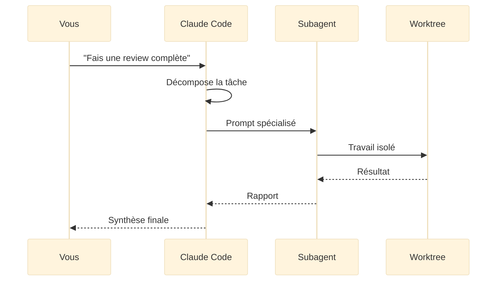

## Les agents, c'est quoi exactement ?

Un **agent** Claude Code est un processus autonome capable d'exécuter une tâche complexe de bout en bout, sans intervention humaine à chaque étape. Contrairement à un simple prompt où vous posez une question et recevez une réponse, un agent **planifie**, **exécute**, **vérifie** et **itère** jusqu'à atteindre l'objectif.

<Callout type="info" title="L'analogie de l'équipe de consultants">
Imaginez que Claude Code est le directeur d'une équipe de consultants spécialisés. Quand vous lui confiez un projet complexe, il ne fait pas tout seul, il **délègue** à des spécialistes. Le consultant sécurité audite le code, le consultant tests écrit les tests, le consultant architecture valide les choix techniques. Chaque consultant (subagent) travaille de manière autonome dans son domaine, puis rend compte au directeur. C'est exactement ainsi que fonctionnent les agents et subagents de Claude Code.
</Callout>

## Agent vs prompt classique

La différence fondamentale entre un agent et un prompt classique tient en trois points.

| | **Prompt classique** | **Agent** |
|---|---|---|
| **Interaction** | Question → Réponse unique | Objectif → Planification → Exécution → Vérification |
| **Autonomie** | Aucune, attend vos instructions | Prend des décisions, utilise des outils, itère |
| **Portée** | Tâche simple et ponctuelle | Workflow complet multi-étapes |
| **Outils** | Utilise les outils que vous demandez | Choisit et combine les outils nécessaires |
| **Durée** | Quelques secondes | Peut durer plusieurs minutes |

## Comment fonctionnent les subagents ?

Un **subagent** est un agent lancé par Claude Code pour accomplir une sous-tâche spécifique. Claude Code utilise le **tool Agent** (aussi appelé `Task`) pour déléguer du travail à des processus enfants.

<Steps>
<Step title="Déclenchement" stepNumber={1}>
Claude Code identifie qu'une tâche nécessite une expertise spécifique ou une exécution isolée. Il décide de lancer un subagent via le tool `Task`.
</Step>

<Step title="Création du subagent" stepNumber={2}>
Le subagent reçoit un **prompt spécialisé** qui décrit sa mission, ses contraintes et le format de résultat attendu. Il hérite d'un sous-ensemble des outils disponibles.
</Step>

<Step title="Exécution isolée" stepNumber={3}>
Le subagent travaille de manière autonome dans son propre contexte. Il peut lire des fichiers, exécuter des commandes, et produire des modifications, le tout sans polluer le contexte de l'agent principal.
</Step>

<Step title="Rapport et intégration" stepNumber={4} isLast>
Le subagent renvoie son résultat à l'agent principal, qui l'intègre dans le workflow global. Si le résultat est insuffisant, l'agent principal peut relancer le subagent ou en créer un nouveau.
</Step>
</Steps>



## Les types d'agents

Les agents Claude Code se répartissent en deux grandes catégories.

### Agents built-in

Ce sont les agents fournis avec Claude Code ou définis dans vos règles de projet. Ils couvrent les cas d'usage les plus courants.

```bash
# Agents de développement
tdd-guide           # Impose le workflow Test-Driven Development
code-reviewer       # Revue de code automatique avec classement par sévérité
build-error-resolver # Diagnostic et correction des erreurs de build

# Agents d'architecture
planner             # Planification structurée avant implémentation
architect           # Décisions d'architecture système

# Agents de qualité
security-reviewer   # Audit de sécurité systématique
e2e-runner          # Tests end-to-end des parcours critiques

# Agents de maintenance
refactor-cleaner    # Nettoyage et suppression du code mort
doc-updater         # Mise à jour de la documentation
```

### Agents custom

Vous pouvez créer vos propres agents en les définissant dans le dossier `~/.claude/agents/` ou `.claude/agents/` de votre projet. Un agent custom est un fichier Markdown qui décrit le rôle, les outils et les instructions de l'agent.

```markdown
# Mon agent de migration de base de données

## Rôle
Tu es un expert en migrations de bases de données.

## Outils disponibles
- Bash (pour exécuter les commandes SQL)
- Read (pour lire les fichiers de migration existants)
- Edit (pour créer de nouvelles migrations)

## Instructions
1. Analyse le schéma actuel de la base de données
2. Compare avec le schéma cible
3. Génère les fichiers de migration nécessaires
4. Vérifie la réversibilité de chaque migration
5. Teste la migration sur une base de données de test
```

## Isolation et worktrees

Un aspect crucial des subagents est leur **isolation**. Quand un subagent modifie du code, il peut travailler dans un **worktree Git** séparé, une copie de travail indépendante du répertoire principal.

<Callout type="tip" title="Pourquoi l'isolation est importante">
Sans isolation, deux subagents travaillant en parallèle pourraient modifier les mêmes fichiers et créer des conflits. Les worktrees garantissent que chaque subagent travaille dans un environnement propre. Une fois le travail terminé, les modifications sont fusionnées dans la branche principale.
</Callout>

```bash
# Claude Code peut lancer un subagent dans un worktree isolé
# Le subagent travaille sur sa propre copie du code
# Pas de conflits avec les autres subagents ou le travail en cours

# Exemple conceptuel de ce que fait Claude Code en interne :
git worktree add /tmp/agent-security-review feature/security-audit
# Le subagent security-reviewer travaille dans /tmp/agent-security-review
# Une fois terminé, les changements sont fusionnés
```

## Configuration des agents

Les agents se configurent à deux niveaux : le répertoire `~/.claude/agents/` pour vos agents personnels, et `.claude/agents/` dans votre projet pour les agents partagés avec l'équipe.

### Le répertoire `~/.claude/agents/`

Ce dossier contient vos agents disponibles dans **tous vos projets**. Chaque fichier `.md` définit un agent.

```bash
~/.claude/
  agents/
    code-reviewer.md      # Review de code automatique
    tdd-guide.md          # Workflow TDD
    security-reviewer.md  # Audit de sécurité
    planner.md            # Planification de features
```

Claude Code détecte automatiquement ces fichiers. Quand vous mentionnez "utilise l'agent code-reviewer" dans une conversation, Claude Code charge le fichier correspondant et crée un subagent avec ces instructions.

### Le répertoire `.claude/agents/` (projet)

Les agents dans ce répertoire sont **versionnés avec Git** et partagés entre les membres de l'équipe. C'est l'endroit idéal pour les agents spécifiques à un projet.

```bash
mon-projet/
  .claude/
    agents/
      db-migration.md     # Spécifique au projet
      api-reviewer.md     # Conventions API de l'équipe
      release-manager.md  # Processus de release
```

<Callout type="tip" title="Priorité des agents">
Si un agent du même nom existe aux deux niveaux, l'agent du projet (`.claude/agents/`) a la priorité sur l'agent global (`~/.claude/agents/`). Votre équipe peut surcharger un agent personnel avec une version adaptée au projet.
</Callout>

### Le fichier AGENTS.md

Le fichier `AGENTS.md` (à la racine du projet ou dans un sous-répertoire) fournit du contexte global à tous les agents. Son rôle est similaire à `CLAUDE.md`, mais focalisé sur le comportement des agents.

```markdown
# AGENTS.md

## Conventions pour tous les agents
- Les rapports doivent être en français
- Les niveaux de sévérité : CRITICAL, HIGH, MEDIUM, LOW
- Les fichiers de test suivent le pattern *.test.ts
- Ne jamais modifier directement les fichiers de configuration

## Agents disponibles dans ce projet
- **db-migration** : gère les migrations Prisma
- **api-reviewer** : vérifie les conventions REST de l'équipe
- **release-manager** : orchestre le processus de release
```

Les agents créés par Claude Code héritent automatiquement du contenu de `AGENTS.md`, en plus de `CLAUDE.md`. C'est un bon endroit pour centraliser les conventions qui s'appliquent à tous les agents du projet.

## L'outil Task (Agent)

Claude Code utilise l'outil **Task** pour créer et gérer les subagents. Voici les paramètres clés :

- **`description`** : la mission du subagent, sous forme de prompt détaillé
- **`subagent_type`** : le type de subagent (`default` pour la plupart des cas)
- **`mode`** : le mode d'exécution du subagent (`agent` pour une exécution autonome)

<Card title="Bon à savoir" variant="highlight">
Vous n'avez pas besoin de manipuler l'outil Task directement. Claude Code l'utilise automatiquement quand il juge qu'une délégation est pertinente. Votre rôle est de configurer les agents disponibles et de donner des instructions claires à Claude Code pour qu'il sache quand les utiliser.
</Card>

### Task pour le suivi multi-étapes

L'outil Task ne sert pas qu'à lancer des subagents. Il permet aussi de **suivre la progression** d'un workflow complexe en créant des tâches intermédiaires. Claude Code découpe un objectif en sous-tâches, marque chacune comme en cours ou terminée, et vous montre l'avancement global.

```bash
# Quand vous demandez un refactoring complexe, Claude Code crée :
# ┌─ Task 1: Analyser le code existant          ✅ Done
# ├─ Task 2: Écrire les tests manquants         ✅ Done
# ├─ Task 3: Refactorer le module auth          🔄 In progress
# ├─ Task 4: Mettre à jour les imports          ⬜ Pending
# └─ Task 5: Vérifier que les tests passent     ⬜ Pending
```

Ce suivi est visible dans la conversation. Vous pouvez intervenir à tout moment : "arrête la tâche 3" ou "saute directement à la tâche 5".

## Exemple concret : review de code avec agents

Voici un scénario typique d'utilisation des agents :

```bash
# Vous demandez à Claude Code une review complète
> Fais une review complète de ma PR avant le merge

# Claude Code orchestre automatiquement :
# 1. Lance le subagent code-reviewer → analyse le diff
# 2. Lance le subagent security-reviewer → vérifie les failles
# 3. Lance le subagent tdd-guide → vérifie la couverture de tests
# 4. Synthétise les résultats des 3 agents
# 5. Produit un rapport consolidé avec priorités
```

Le résultat est une review **multidimensionnelle** qui couvre la qualité du code, la sécurité et les tests, le tout en une seule commande.

## Prochaines étapes

Maintenant que vous comprenez le concept des agents et subagents, passons à la pratique.

- [Créer un subagent spécialisé](/agents/create-subagent) : Guide complet pour créer vos propres agents custom
- [Agent Teams](/agents/agent-teams) : Faire collaborer plusieurs agents ensemble
- [Top agents par cas d'usage](/agents/best-agents) : Les agents incontournables pour chaque situation
